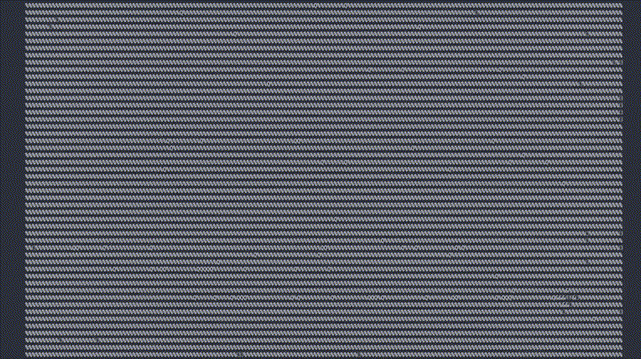
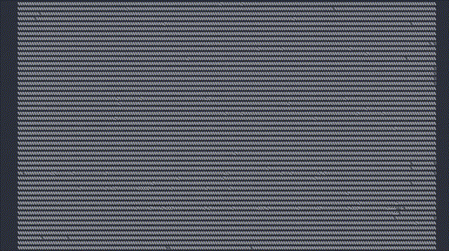

<!-- ========================= HEADER ========================= -->
---

# 👋 Hi, I'm Shubham Verma

  

    

      

      

      

      

        kali@tplay: ~/me2.mp4
      

    

    

      kali@tplay
      :
      ~/Desktop/me/tplay
      $ 
      cargo run --release -- ./me2.mp4
    

    <!-- GIF -->
    

      
    

    

      ▶ Playing · 120 frames @ 12fps · Loop ∞
      CHARS: ALL (99) · BT.709 · 120×40
    

  

---

# 👋 Hi, I'm Shubham Verma
<!--  -->

<!--  -->

<!--  -->

<!-- <a href="https://github.com/swaraj-shubh">
  <kbd>
    
  </kbd>
</a>
<a href="https://github.com/swaraj-shubh">
  <kbd>
    
  </kbd>
</a>
<a href="https://github.com/swaraj-shubh">
  <kbd>
    
  </kbd>
</a> -->

  

### 🚀 Competitive Programmer • Full Stack Developer • Problem Solver

  

---

# 💫 About Me

- 💻 Full Stack Developer passionate about building impactful products
- 🏆 Competitive Programmer
- 🚀 Hackathon Enthusiast
- 🌱 Always learning new technologies
- 🤝 Love collaborating on innovative ideas

> Building real-world systems, solving hard problems and creating useful solutions.  
> I enjoy connecting with people, sharing ideas, and learning together.

---

# 🔗 Links

---

<!-- # 💻 Tech Stack

 -->

---

# 🚀 Technologies

| Category | Technologies |
|-----------|--------------|
| **Languages** | Java • C • C++ • JavaScript • TypeScript • Python |
| **Frontend** | React • Next.js • Vite • HTML • CSS • Tailwind CSS • ShadCN UI |
| **Backend** | Node.js • Express |
| **Database** | MongoDB • Firebase |
| **Deployment** | Vercel • Netlify • Render |
| **Tools** | Git • GitHub • VS Code • Postman • Cloudinary • NPM |

---

# 🏆 Competitive Programming

---

# 📊 Profile Summary Cards

---

## 📫 Let's Connect

---

### ⭐ Thanks for visiting!

If you like my work, consider ⭐ starring my repositories.

